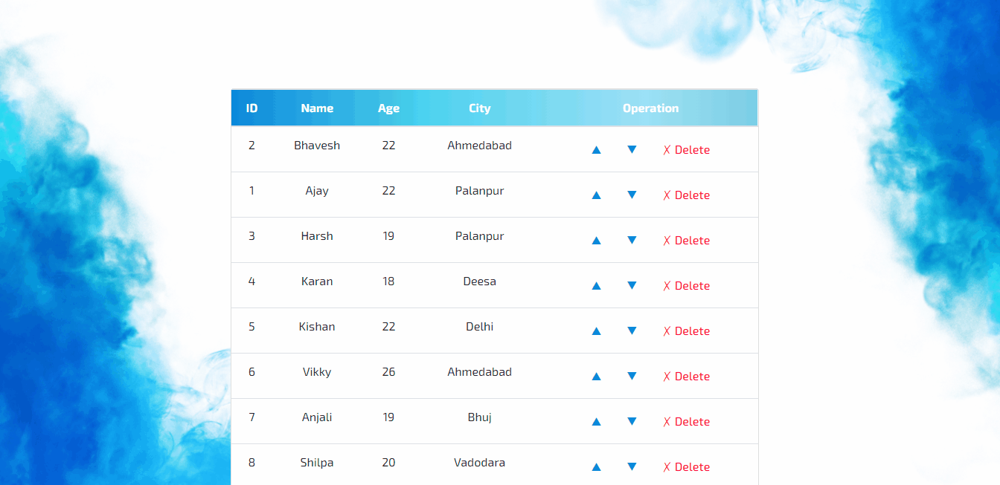

 

  

  <h3 align="center"> <b>React Parent Child Communication</b> </h3>

  

    This project is based component data sharing.
  

 
 

## About Project   

* Screen GIF

    

* In project **Data created in Parent and passed to Child** using props.
* From child component data displayed in DOM then performed **Delete and Swipe** operations

 

## Built With

 

 &nbsp;  **React**

 

